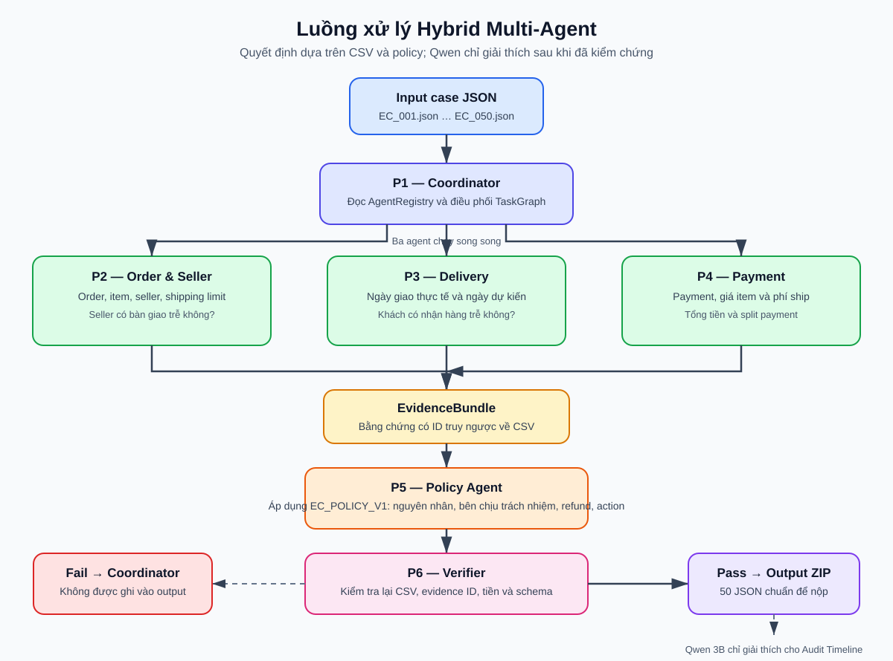
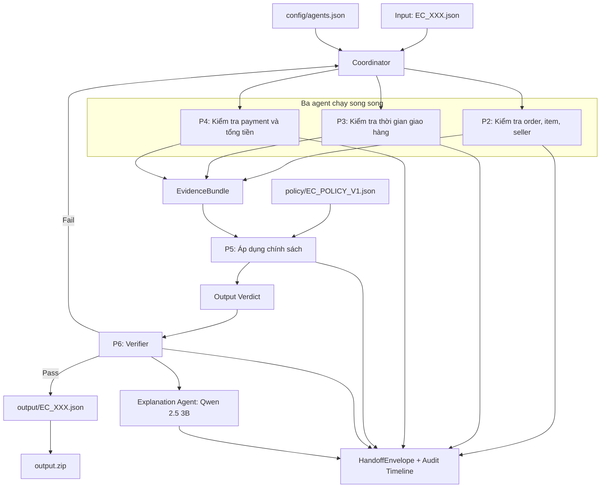

# Kiến trúc Hybrid Multi-Agent xử lý khiếu nại đơn hàng

## 1. Bài toán hệ thống giải quyết

Mỗi file đầu vào `EC_XXX.json` chứa một mã đơn hàng mà khách hàng cho rằng
giao trễ. Hệ thống phải đối chiếu dữ liệu Olist để xác định:

- đơn có bị hủy hoặc unavailable không;
- khách có thực sự nhận hàng trễ không;
- seller hay đơn vị logistics chịu trách nhiệm;
- cần hoàn bao nhiêu tiền và thực hiện hành động nào;
- bằng chứng nào có thể truy ngược về dữ liệu CSV.

Kết quả cuối cùng là một JSON chuẩn cho mỗi case và một ZIP chỉ chứa 50 JSON
để nộp bài.

## 2. Ý tưởng chính

Đây là **hệ hybrid multi-agent**. Không phải tất cả agent đều là LLM.

- Các agent điều tra dữ liệu dùng CSV và rule xác định, nên số tiền, ngày tháng
  và evidence luôn lặp lại được, không bị hallucination.
- Qwen 2.5 3B chỉ dùng ở cuối luồng để viết lời giải thích cho audit. Model
  không được phép sửa quyết định, refund hay action đã được kiểm chứng.

Một agent trong hệ thống có nhiệm vụ, quyền đọc dữ liệu, đầu ra và handoff
riêng. Vì vậy P2, P3 và P4 vẫn là các specialist agent dù không cần gọi LLM.

## 3. Luồng xử lý



> Markdown Preview sẽ hiển thị trực tiếp sơ đồ SVG ở trên. Phần Mermaid bên
> dưới được giữ lại để có thể chỉnh sửa sơ đồ bằng code khi cần.



## 4. Diễn giải từng bước theo ngôn ngữ đơn giản

### Bước 1 — Nhận case và giao việc

Coordinator nhận mã đơn hàng từ input. Nó không tự suy đoán nguyên nhân;
nhiệm vụ của nó là giao đúng việc cho agent phù hợp, chờ kết quả rồi lắp JSON
cuối cùng.

`AgentRegistry` đọc `config/agents.json`, vì vậy Coordinator không cần
hard-code tên module agent. `TaskGraph` đọc dependency để bảo đảm P2/P3/P4
chạy song song, còn P5 chỉ chạy khi đã có đủ ba kết quả.

### Bước 2 — Ba agent điều tra song song

| Agent | Agent kiểm tra gì? | Kết quả bàn giao |
| --- | --- | --- |
| P2 — Order & Seller | trạng thái order, item, seller, deadline giao cho carrier | seller có giao trễ hay không; ID order/item/seller |
| P3 — Delivery | ngày giao thực tế và ngày giao dự kiến | khách có nhận hàng trễ hay không |
| P4 — Payment | payment rows, giá item, phí ship | tổng tiền, split payment có hợp lệ hay không |

Mỗi agent chỉ đọc phần dữ liệu thuộc domain của mình. Ví dụ P2 không đọc
payment; P4 không suy luận seller giao trễ.

### Bước 3 — Gom bằng chứng và áp dụng chính sách

Ba kết quả được gom thành `EvidenceBundle`. P5 đọc bảng
`policy/EC_POLICY_V1.json` theo đúng thứ tự ưu tiên để ra quyết định.

Ví dụ:

```text
Khách nhận hàng trễ
+ seller giao cho carrier sau shipping_limit_date
→ nguyên nhân: SELLER_HANDOFF_AFTER_LIMIT
→ seller chịu trách nhiệm
→ hoàn phí ship
```

Hoặc:

```text
Order bị canceled và payment_total > 0
→ nền tảng chịu trách nhiệm
→ hoàn toàn bộ payment_total
```

## 5. Verifier là cổng bắt buộc trước khi xuất file

P6 kiểm tra lại từ CSV, độc lập với quyết định của P5:

- evidence ID có tồn tại thật không;
- item, seller và payment có đúng với order không;
- số tiền có khớp và làm tròn hai chữ số không;
- root cause, party, refund, action có khớp policy không;
- JSON có đúng schema và giới hạn số lượng ID không.

Nếu fail, case không được ghi vào `output/`. Chỉ verdict pass mới được nén vào
`output.zip`.

## 6. Handoff và audit

Mỗi agent tạo `HandoffEnvelope` gồm tên agent, case ID, evidence IDs, thời gian
bắt đầu/kết thúc, duration, dependency và trạng thái. Các handoff được dùng để
tạo:

- `logging/audit_timeline.json` cho máy đọc;
- `logging/audit_timeline.html` để trình diễn trực quan;
- Evidence Receipt, giúp truy ngược JSON cuối về policy và CSV.

Nhờ vậy, hệ thống không chỉ trả kết quả mà còn chứng minh được tại sao kết quả
đó đúng.

## 7. Vai trò của Qwen và confidence

Qwen/Qwen2.5-3B-Instruct (3.09B tham số) chỉ chạy sau khi Verifier pass, nhằm
viết lời giải thích dễ đọc. Nó không có quyền thay đổi JSON nộp bài.

`confidence = 1.0` biểu diễn **độ chắc chắn của rule đã được kiểm chứng**,
không phải xác suất do LLM dự đoán. Vì các điều kiện được tính trực tiếp từ CSV
và P6 kiểm tra lại, giá trị này là hợp lý cho pipeline xác định.

## 8. Điểm mạnh khi thuyết trình

> Hệ thống không dùng nhiều agent chỉ để đặt tên. Mỗi agent có phạm vi dữ liệu
> riêng, bàn giao bằng chứng có cấu trúc, áp dụng policy minh bạch và bị
> Verifier kiểm chứng trước khi xuất kết quả.

Điều này kết hợp được hai ưu điểm: độ chính xác của rule/data pipeline và khả
năng diễn giải tự nhiên của model nhẹ dưới 10B tham số.
